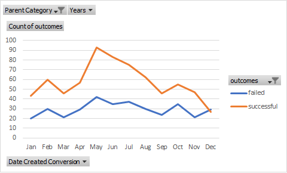

## Kickstarter-Analysis

## Overview of Project
   
   Louise who is an upcoming writer wants to start a fundraising campaign to help fund her first play "Fever'. Her budget is $10,000. We used Excel to help her 
   organie and analyze the crowd funding datato see if their are any specifics to make her project successful.
   
## **Purpose**

    Louise wants to see how different campaigns progressed in regard to their Launch Date and their Funding goals

### **Analysis and Challenges**
  
   For the first analysis I created a Year column and used a fuction to generate Year from the launched date column.
   I then created a Pivot table filtering it 
   to parent category and years. I created a Pivot table and a Pivot chart to see the relation between outcome and launch months. 
   I did not face any challenge in this part of the assignment.
  - Second part of the assignment was to create a new spreadsheet which is outcomes based on goals. 
  - In this part I created a sheet specifying the ranges of goals and
   in relation to that the number of successful,cancelled and failed and their respective percentages.
   I did had hard time using the countifs statement to calculate the 
   data but one of the TA were able to help me solve that. 

### **Analysis of Outcomes Based on Launch Date**
   
    -The data showed that the number of successful shows were more then failed.
    In the begining if the year the outcome was low but in mid year and summer time it took
    an uptick on the number of successful shows.Then again by fall time it started to go down. 
    So I think summer time was the most successful time for the campaign.    

    

### **Analysis of Outcomes Based on Goals**
   
    -The data analysis in regards to outcome based on goals show that the number of failed shows between 
    the range of $15000-$34999 were high as compared to successful. 
    The percentage of successful is less than as compared to the percentage of failed.
    

   

### **Results**

 The conclusion I can draw from Outcome based on launch date that the mid time of the year is the best time to launch the play as the data shows that it was the most successful
  during that time 

 The conclusion I draw from outcome based on goal is that Louise bugdet for the project should between the range og $10,000-$15999. As we see from the data analysis that
  the projects whose goal was above that range failed. 
  Louise play fever should be launced in mid months of the year that is summer and her budget to make her play successful should be below $15999

